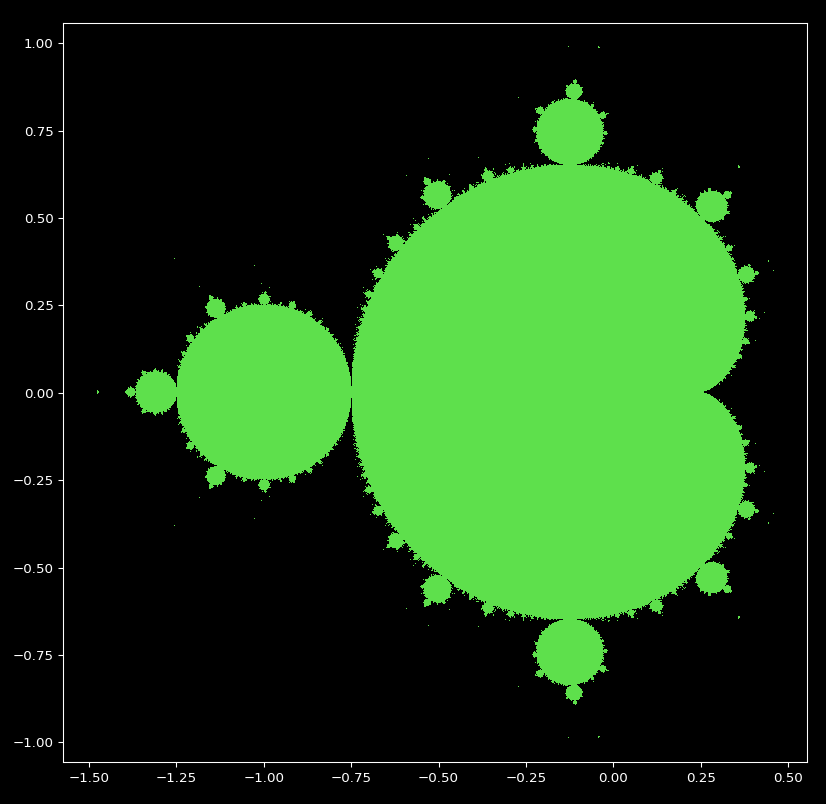
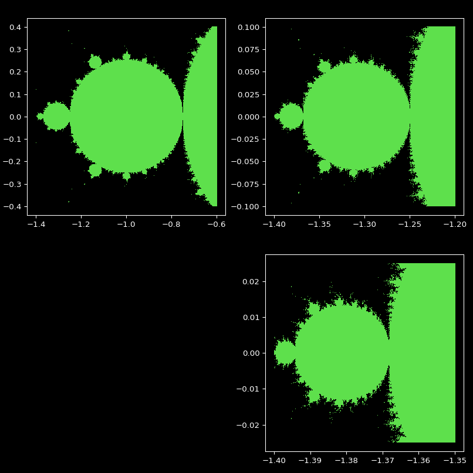
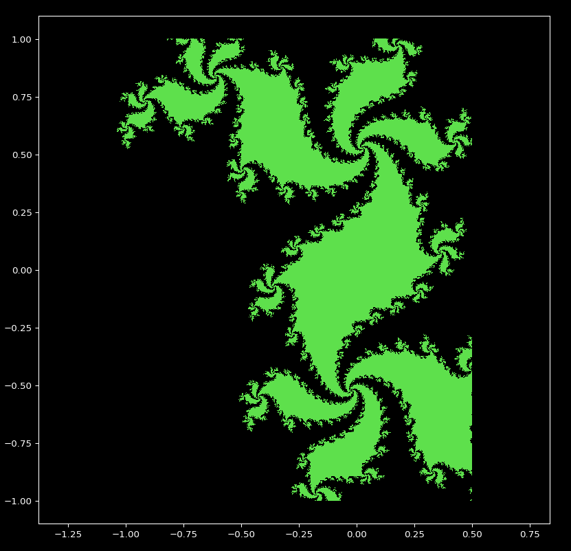

# Mandelbrot set

The Mandelbrot set is the set of complex numbers c for which the function fc(z)=z2+c does not diverge when iterated from z=0, i.e., for which the sequence fc(0),fc(fc(0)), etc., remains bounded in absolute value.

All the values ​​of the mandelbrot set represented in a reference are called fractals. Indeed, the same form is repeated infinitely towards the infinite small:





Julia set is the same than Mandelbrot set but it takes a complex number on Z0. 



## Installation
Get library to draw functions:
``` bash
pip install matplotlib
```
Clone the repo or download zip:
``` bash
git clone https://github.com/clabroche/Mandelbrot-set.git
```

## Usage
Go to the directory:
``` bash
cd Mandelbrot-set
```
Execute mandelbrot.py to draw mandelbrot set
``` bash
python mandelbrot.py
```

Execute julia.py to draw julia set
``` bash
python julia.py
```